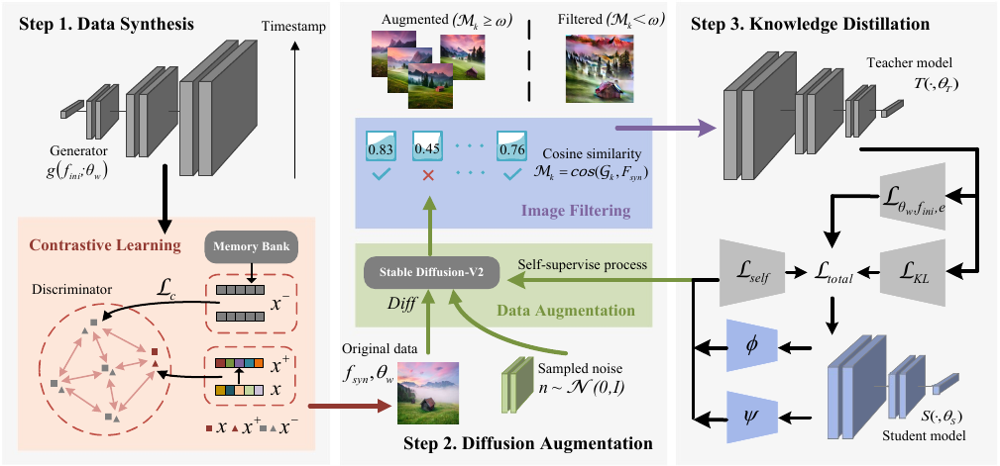

## Towards Effective Data-Free Knowledge Distillation via Diverse Diffusion Augmentation

MM2024 paper: Towards Effective Data-Free Knowledge Distillation via Diverse Diffusion Augmentation.

Author: Muquan Li,  Dongyang Zhang,  Tao He,  Xiurui Xie,  Yuan-Fang Li,  Ke Qin



### 1. Environment

This repository is tested with Ubuntu 18.04.5 LTS, python 3.6.5, pytorch 1.7.1 and cuda 11.4.

### 2. Get the pre-trained teacher model

```
python train_scratch.py --model wrn40_2 --dataset cifar10
```

After the training is completed, the teacher model will be saved as `checkpoints/pretrained/cifar10_wrn40_2.pth`.

Or you can directly download pre-trained teacher models from [Dropbox-Models (266 MB)](https://www.dropbox.com/sh/w8xehuk7debnka3/AABhoazFReE_5mMeyvb4iUWoa?dl=0) and extract them as `checkpoints/pretrained`.

### 3. Initialize image bank

To prevent the student from overfitting to data generated by early training rounds, it is necessary to synthesize some data firstly to initialize image bank by removing $\mathcal{L}_{csd}$ , i.e., setting the flag `--csd` to `0`, and running 400 synthesis batches with each one containing 200 samples.

```
bash scripts/csd/csd_cifar10_initBank_wrn402.sh
```

### 4. Diffusion Augmentation

Augment images through [Stable Diffusion-V2](https://huggingface.co/spaces/lambdalabs/stable-diffusion-image-variations)

### 5. Train student with DDA

```
bash scripts/dda/dda_cifar10_wrn402_wrn161.sh
```

### 6. Train student with comparison methods

```
bash scripts/xxx/xxx.sh # e.g. scripts/zskt/zskt_cifar10_wrn402_wrn161.sh
```

### Citation

```BibTeX
@inproceedings{DBLP:conf/mm/LiZ0XLQ24,
  author       = {Muquan Li and
                  Dongyang Zhang and
                  Tao He and
                  Xiurui Xie and
                  Yuan{-}Fang Li and
                  Ke Qin},
  title        = {Towards Effective Data-Free Knowledge Distillation via Diverse Diffusion
                  Augmentation},
  booktitle    = {Proceedings of the 32nd {ACM} International Conference on Multimedia,
                  {MM} 2024, Melbourne, VIC, Australia, 28 October 2024 - 1 November
                  2024},
  pages        = {4416--4425},
  publisher    = {{ACM}},
  year         = {2024},
}
```

